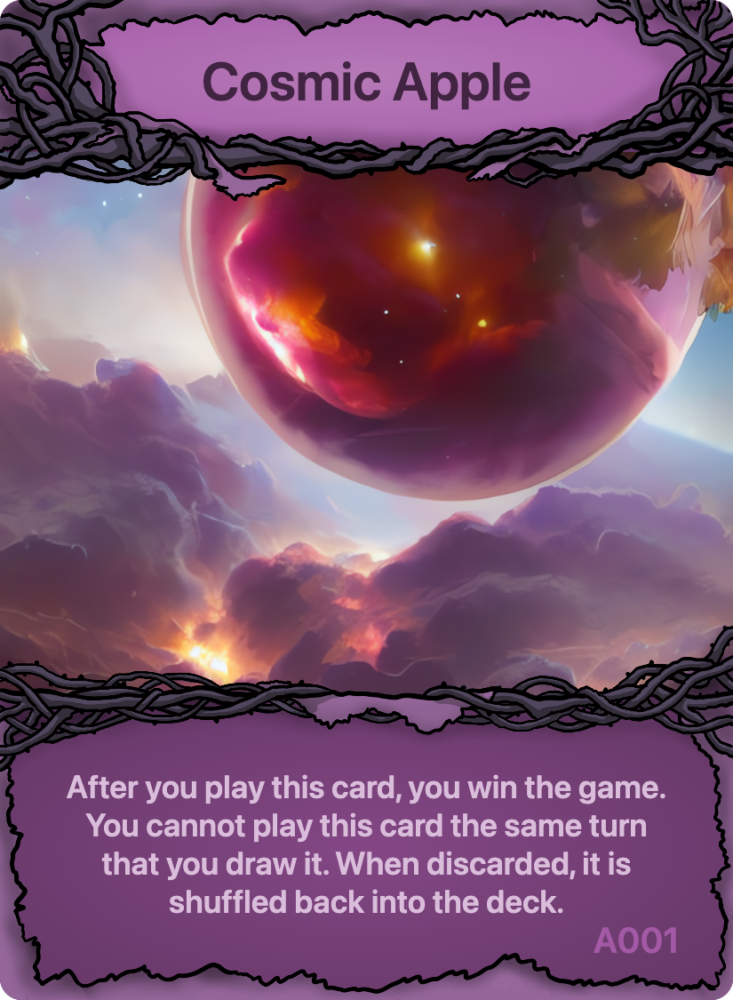
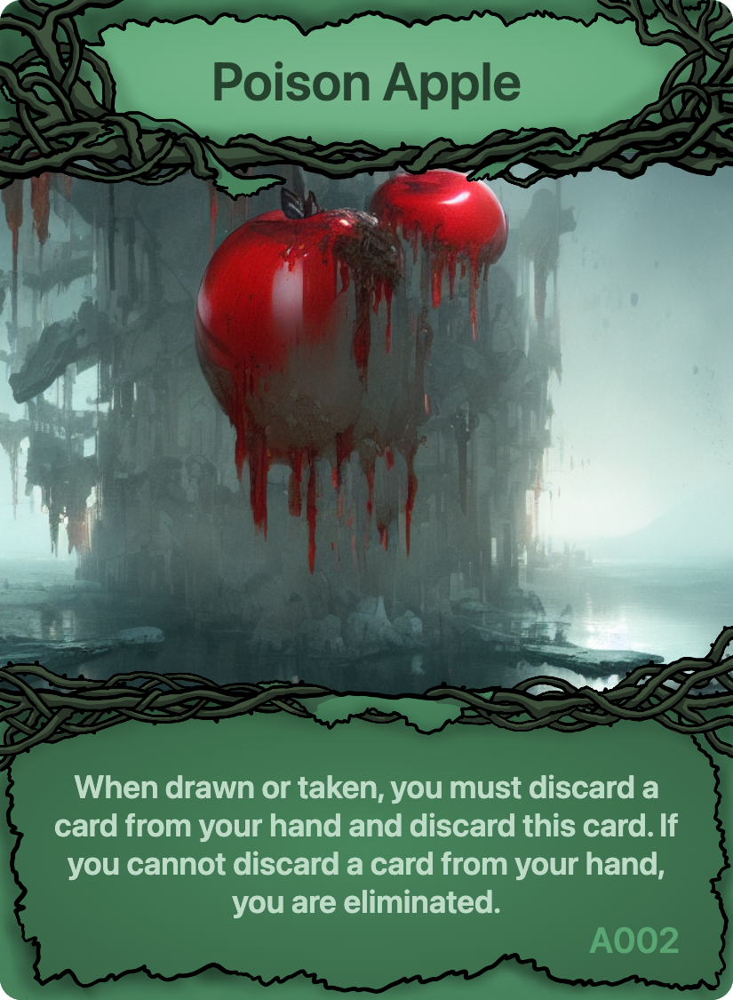

![screen-1]
        
# Cosmic Apple

[![][stars]][gh-url]
[![][release]][gh-url]
[![][last-commit]][gh-url]

## Game Type
`Elimination`, `Hand Management`, `Push Your Luck`, `Take That`

## Player Count
2 - 6 Players

## Weight/Complexity
1.0/5.0 (low)

## Story

<i>Years ago a television broadcast was emitted of a particularly tasty apple cider brand. The producers of the commercial celebrated that they had outdone themselves. Immediately after the broadcast, an entity from outer space appeared on Earth. The entity yielded imense power and consumed all of the world's apple cider supply. The entity was unsatisfied with any of the apple cider the world had produced and so 
it began mutating apples at an unnatural rate and squeezing them into new forms of cider. This foreign visitor became known as the Cosmic Apple. You must seek it out and be the first to know the answer to the ultimate question: "what is the universe's tastiest cider?"</i>

## Components
- 54 Cards Total
  - 2 Instruction Cards
  - 1 Cosmic Apple
  - 8 Poison Apples
  - 8 Lush Apples
  - 7 Other Apple Sets (5 cards each)

## Setup

1. Shuffle all cards together except the `Cosmic Apple` to form the deck.
2. Split the deck in half and shuffle the `Cosmic Apple` into the lower half.
3. Each player draws two cards (Ignore any 'when drawn' effects).
        
## Each Turn

- Take any two actions each turn:
  - Draw a card from the deck.
  - Play a card from your hand.
- You may not draw a card if you have 5 or more cards in your hand.
- You must take exactly two actions each turn.

## Game End

The game ends after a player plays the `Cosmic Apple` card, or after only one player is left in the game.

## Strategy
You want to balance how many cards you have in your hand and how fast you draw through the deck. If you draw too fast, you may be forced to play your hand. If you are out of cards in your hand, you are vulnerable to drawing the `Poison Apple`. If you take it too slow and hoard cards, another player may begin playing your cards for you, or find the `Cosmic Apple` before you have a chance.

## Card Overview

### Cosmic and Poison Apples
The `Cosmic Apple` is the most important card in the game. Once it is played, the game ends, and the player that played it is the winner. As you draw cards you have to be careful not to draw any `Poison Apple` cards. As soon as you do, you have to discard a card from your hand. If you have no cards in your hand, you are eliminated from the game.

 

### Attack and Defense Cards
Use attack cards like `Fire Apple` and `Golden Apple` to target other players. Defend yourself from attacks with the `Crystal Apple`.

  

### Manipulation Cards
The remaining cards allow you to manipulate the deck, your hand, or how fast you draw from the deck.

    

## Acknowledgements
Game created using [Cider][cider].

[gh-url]: https://github.com/oatear/cosmic-apple-game
[stars]: https://badgen.net/github/stars/oatear/cosmic-apple-game?cache=600
[release]: https://badgen.net/github/release/oatear/cosmic-apple-game?cache=600
[last-commit]: https://img.shields.io/github/last-commit/oatear/cosmic-apple-game
[cider]: https://github.com/oatear/cider
[screen-1]: assets/cosmic-apple.png
